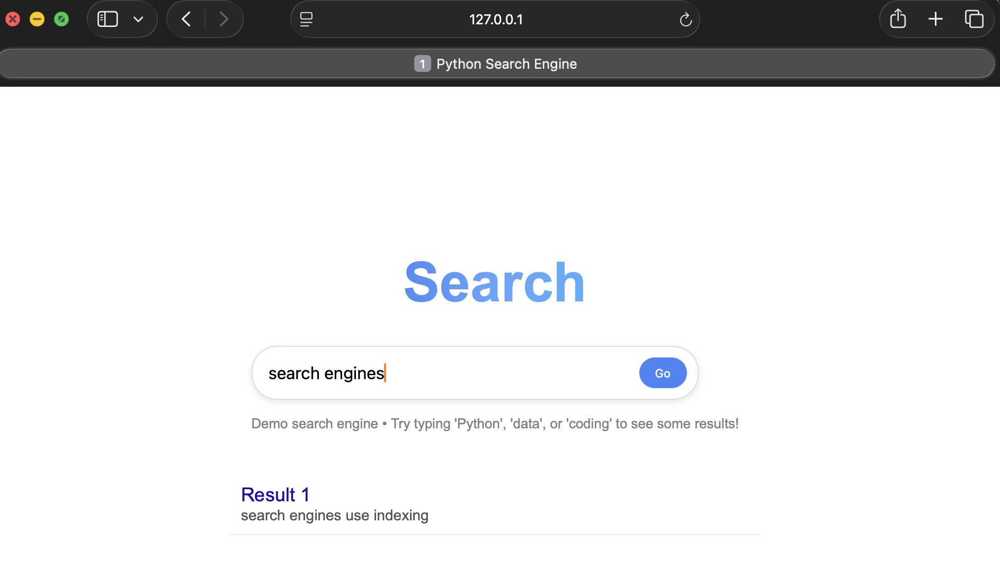

# Python Search Engine

A simple full-stack search engine built with Flask and SQLite.  
It uses an inverted index to search documents and return ranked results quickly.

---

## 🚀 Features
- Flask web framework
- SQLite database storage
- Inverted index for fast searching
- Basic ranking by keyword match frequency
- Simple web UI for querying

---

## 🧠 How It Works
1. Documents are stored in a database
2. An inverted index maps words → documents
3. User query is split into keywords
4. Matching documents are ranked by relevance

---

## 🛠 Tech Stack
- Python
- Flask
- SQLite
- HTML/CSS (templates)

---

## ▶️ How to Run Locally

Follow these steps to run the project on your machine:

### 1. Clone the repository
git clone https://github.com/SFelix-Dev/python-search-engine.git
cd python-search-engine

### 2. Create a virtual environment (optional but recommended)
python -m venv venv
source venv/bin/activate   # Mac/Linux
venv\Scripts\activate      # Windows

### 3. Install dependencies
pip install -r requirements.txt

### 4. Run the application
python app.py

### 5. Open in your browser
http://127.0.0.1:5001

## 📸 Demo

